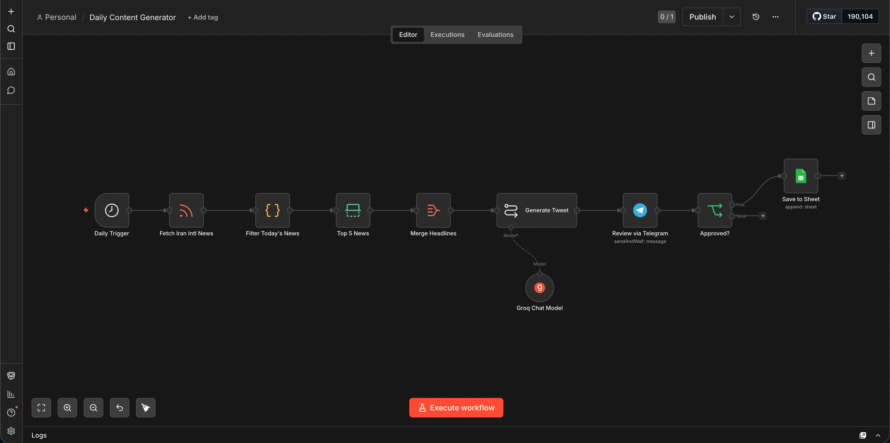
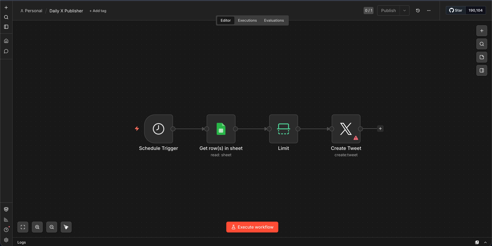

# 📰 n8n Social Content Scheduler

<p align="center">
  
</p>

<p align="center">
  
  
  
  
</p>

> A fully automated, human-in-the-loop news-to-tweet pipeline built with n8n. Fetches today's headlines from any RSS source, generates a tweet using AI, sends it to you on Telegram for review, and — once approved — saves it to Google Sheets ready to post on X (Twitter).

---

## ✨ Features

- 🔄 **Fully automated** — runs on a daily schedule, no manual work needed
- 🤖 **AI-powered** — uses Groq (LLaMA 3.3 70B) to write natural, engaging tweets
- 👀 **Human-in-the-loop** — you review and approve every tweet via Telegram before it goes anywhere
- 📊 **Organized storage** — approved tweets are saved to Google Sheets with status tracking
- 🔌 **Plug-and-play** — works with any RSS news source
- 🆓 **Free to run** — Groq API is free; n8n can be self-hosted

---

## 🖼 Preview

| Daily Content Generator | Daily X Publisher |
|------------------------|-------------------|
|  |  |

---

## 🔄 How It Works

```
┌─────────────┐     ┌──────────────────┐     ┌───────────────┐     ┌──────────────┐
│ RSS Feed    │────▶│ Filter Today's   │────▶│ Top 5         │────▶│ Merge        │
│ (any source)│     │ News (24h)       │     │ Headlines     │     │ Headlines    │
└─────────────┘     └──────────────────┘     └───────────────┘     └──────┬───────┘
                                                                           │
                                                                           ▼
┌─────────────┐     ┌──────────────────┐     ┌───────────────┐     ┌──────────────┐
│ Save to     │◀────│ Approved?        │◀────│ Review via    │◀────│ Generate     │
│ Google Sheet│     │ (Yes/No)         │     │ Telegram      │     │ Tweet (AI)   │
└─────────────┘     └──────────────────┘     └───────────────┘     └──────────────┘
```

**Workflow 2** then runs 1 hour later and posts approved tweets to X automatically.

---

## 🧩 Workflows

| File | Trigger | Description |
|------|---------|-------------|
| `daily-content-generator.workflow.json` | Daily at 9:00 AM | Fetches news → generates tweet → sends to Telegram for approval → saves to Google Sheets |
| `daily-x-publisher.workflow.json` | Daily at 10:00 AM | Reads approved tweets from Google Sheets → posts to X (Twitter) |

---

## 🛠 Requirements

| Tool | Purpose | Cost |
|------|---------|------|
| [n8n](https://n8n.io) | Workflow automation engine | Free (self-hosted) |
| [Groq](https://console.groq.com) | AI tweet generation (LLaMA 3.3 70B) | Free |
| Telegram Bot | Human review & approval | Free |
| Google Sheets | Tweet storage & tracking | Free |
| X Developer Account | Auto-posting to X | Free (1,500 tweets/month) |

---

## ⚙️ Setup

### 1. Import Workflows into n8n

1. Open your n8n instance
2. Click **"+ New Workflow"** → **"Import from file"**
3. Import `workflows/daily-content-generator.workflow.json`
4. Repeat for `workflows/daily-x-publisher.workflow.json`

### 2. Connect Groq (AI)

1. Create a free API key at [console.groq.com](https://console.groq.com)
2. In the **Groq Chat Model** node, add a new credential and paste your key
3. Model is pre-set to `llama-3.3-70b-versatile`

### 3. Connect Telegram

1. Create a bot via [@BotFather](https://t.me/BotFather) → copy the bot token
2. Get your chat ID via [@userinfobot](https://t.me/userinfobot)
3. In the **Review via Telegram** node, add your bot token and set your chat ID

### 4. Connect Google Sheets

1. Create a new Google Sheet with these exact column headers:

   | tweet_text | status | created_date | posted_date |
   |-----------|--------|--------------|-------------|

2. In n8n, connect your Google account via OAuth2
3. Select your sheet in both the **Save to Sheet** and **Read Approved Tweets** nodes

See `sample-data/sample-data.csv` for an example of the expected format.

### 5. Set Your RSS Feed

Open the **Fetch News** node and replace the URL with your preferred source.

**Example using Google News proxy:**
```
https://news.google.com/rss/search?q=site:YOUR_SITE.com&hl=en-US&gl=US&ceid=US:en
```

### 6. Configure Environment Variables

Copy `.env.example` to `.env` and fill in your values:

```bash
cp .env.example .env
```

### 7. Activate

1. Activate **Daily Content Generator** — runs at 9:00 AM daily
2. Activate **Daily X Publisher** — runs at 10:00 AM daily

---

## 📲 Approval Flow

When a tweet is generated, you receive a Telegram message like this:

```
🗞 Draft Tweet:

Breaking: New climate report reveals record temperatures across Europe.
Scientists urge immediate action. #ClimateChange #GlobalWarming

Approve to save to Google Sheets?

[ ✅ Approve ]  [ ❌ Skip ]
```

- **Approve** → saved to Google Sheets, picked up by Workflow 2 for posting
- **Skip** → discarded, nothing gets posted

---

## 🗂 Project Structure

```
n8n-social-content-scheduler/
├── workflows/
│   ├── daily-content-generator.workflow.json   # Workflow 1
│   └── daily-x-publisher.workflow.json         # Workflow 2
├── docs/
│   ├── setup-guide.md                          # Detailed setup guide
│   └── screenshots/
│       ├── workflow-overview.png
│       └── daily-x-publisher.png
├── sample-data/
│   └── sample-data.csv                         # Example Google Sheet format
├── templates/
│   ├── tweet-template.md                       # Customize the AI prompt
│   └── notification-template.md               # Customize Telegram messages
├── README.md
└── .env.example                                # Environment variable template
```

---

## 🎨 Customization

### Change the AI Prompt
Edit the prompt inside the **Generate Tweet** node or see `templates/tweet-template.md` for ideas.

### Change the News Source
Replace the RSS URL in the **Fetch News** node with any valid RSS feed.

### Change the Schedule
Update trigger times in the **Daily Trigger** node of each workflow.

---

## 🤝 Contributing

Contributions, issues and feature requests are welcome!

1. Fork the repository
2. Create a new branch (`git checkout -b feature/my-feature`)
3. Commit your changes (`git commit -m 'Add my feature'`)
4. Push to the branch (`git push origin feature/my-feature`)
5. Open a Pull Request

---

## 📄 License

This project is licensed under the [MIT License](LICENSE).

---

<p align="center">Built with ❤️ using <a href="https://n8n.io">n8n</a></p>
